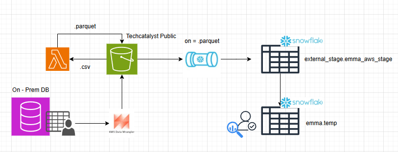

# Lab 1 Emma Paradis

#### Analysis Table:

| **Method**         | **Purpose** | **Best Use Cases** | **Pros** | **Cons** |
| ------------------ | ----------- | ------------------ | -------- | -------- |
| `upload_file`      | Upload file to an S3 bucket. | large-file parallel uploading | efficient handling of large files | less advanced configurations / no ACLs |
| `upload_fileobj`   | Uploads a file-like object to S3 | file-like object uploading directly to S3 | managed transfer / can use ACLs | Can only be opened in binary mode not text mode |
| `put_object`       | add an object to an S3 bucket | Uploading files with specific configurations | Can use ACLs / Can add metadata | No support for multipart uploads / file must be < 5gb  |
| `download_file`    | downloads an object and saves to file | When you want to save an object locally | Support extra arguments and callback parameters  | does not support downloading full buckets         |
| `download_fileobj` | downloads a file like object to a file | When you want to save a file-like object locally | can handle file like objects | Can only be opened in binary mode |
| `get_object`       | retrieve an object from S3 | To view an object in a bucket using a key | faster than manual file handling | complex to implement and manage |

#### Reflection Questions:

1. **Upload Methods**:
   - What are the key differences between `upload_file`, `upload_fileobj`, and `put_object`?

    upload file is efficient at handling large files due to multipart uploads, upload_fileobj can only handle file-type ojects in binary and does not support large files < 5gb, put_object can upload files with specific configs but also struggles with larger files. 
   - When would you choose to use `put_object` over `upload_file` or `upload_fileobj`?
   
    I would choose put_object for when I want to add an object to S3 with specific configurations, I would use upload_file for files larger than 5gb, and I would use upload_filobj for files that needed to be read in binary format. 
2. **Download Methods**:
   - How does `download_file` differ from `download_fileobj` and `get_object`?
   - In what scenarios would `get_object` be more beneficial than `download_file`?
3. **Efficiency and Performance**:
   - How do multipart uploads and downloads enhance the performance of file transfer operations?
   - What are the limitations of using `put_object` and `get_object` for large files?
4. **Practical Applications**:
   - Consider a scenario where you need to upload a large video file to S3. Which method would you use and why?
   - If you need to process data in memory before saving it locally, which download method would be most suitable?

---

# Lab 2: Exploring AWS Boto3

### Load your credentials

```python
from dotenv import load_dotenv
load_dotenv()  

import boto3
import os

s3_client = boto3.client('s3')

buckets = s3_client.list_buckets()
for bucket in buckets['Buckets']:
    if 'techcatalyst' in bucket['Name']:
        print(bucket['Name'])

# list objects in a specific bucket "techcatalyst-raw" 
bucket_name = 'techcatalyst-raw'
objects = s3_client.list_objects_v2(Bucket=bucket_name)
for obj in objects.get('Contents', []):
    print(obj['Key'])

# list objects that are CSV in a specific bucket "techcatalyst-raw" 
for obj in objects.get('Contents', []):
    if (obj['Key']).endswith('.csv'):
        print(obj['Key'])

s3_client.download_file(Bucket='techcatalyst-raw',  # from which bucket
                        Key='stocks/GOOG.csv',
                        Filename='emma_goog.csv') # Filename is what you want to call it once it is downloaded

import io
io_temp = io.BytesIO()
temp = s3_client.download_fileobj(Bucket='techcatalyst-raw',  # from which bucket
                                Key='stocks/GOOG.csv',
                                Fileobj=io_temp) # pass th io.BytesIO object

print(io_temp.getvalue()[:100])

with open('google_stock_downloaded.csv', 'wb') as f:
    f.write(io_temp.getvalue())

s3_client.upload_file(Filename='emma_goog.csv', # local file name
                      Bucket='techcatalyst-raw', # the bucket target
                      Key='EMMA/emna_goog.csv') # destination name, make sure it include YOURNAME/ANY_FILE_NAME.csv

in_memory_file = io.BytesIO(b"Uploading in memeory file!")
s3_client.upload_fileobj(Fileobj=io_temp,
                          Bucket='techcatalyst-raw', 
                          Key='EMMA/emna_goog.txt') # destination name, make sure it include YOURNAME/ANY_FILE_NAME.txt

objects = s3_client.list_objects_v2(Bucket='techcatalyst-raw', Prefix='EMMA/')
objects.keys()
objects['Contents']

```

# Lab 3: Introduction to AWS Wrangler

```python
!pip install awswrangler

from dotenv import load_dotenv
load_dotenv()

import awswrangler as wr

df = wr.s3.read_csv('s3://techcatalyst-raw/stocks/GOOG.csv')
df.head()

df.info()

databases = wr.catalog.databases()
print(databases)

name = 'emma'
database_name = f"{name}_db"
wr.catalog.tables(database=database_name)

wr.s3.to_parquet(
    df=df, # the DataFrame you just created 
    path=f"s3://techcatalyst-raw/{name}/", # write to the techcatalyst-raw bucket under your folder name (or it would create a new folder if it does not exist)
    dataset=True, 
    database='emma_db', # the name of the database you just created in AWS Glue 
    table= 'emma_stock', # pick a table name for example YOURNAME_STOCK
    mode='overwrite'
    )

wr.catalog.tables(name_contains="stock")

import pyarrow
df = wr.s3.read_parquet_table(database='emma_db',
                               table='emma_stock')

wr.catalog.get_table_types(database='emma_db',
                               table='emma_stock')

table_details = wr.catalog.get_tables(database='emma_db')

desc = "This is my stock table."
param = {"source": "Google", "class": "stock"}
comments = {
    "Date": "Trading Date",
    "Open": "Opening Price",
    "Close": "Closing Price"
}

wr.s3.to_parquet(
    df=df,
    path='s3://techcatalyst-raw/emma/',
    dataset=True,
    database='emma_db',
    table='emma_stock',
    mode='overwrite',
    glue_table_settings=wr.typing.GlueTableSettings(description=desc,  # here we are passing some metadata
                                                    parameters=param, 
                                                    columns_comments=comments),
    )

wr.catalog.table(database='emma_db', table='emma_stock')

wr.s3.list_objects('s3://techcatalyst-raw/emma/')

wr.s3.download(path='s3://techcatalyst-raw/stocks/GOOG.csv', 
               local_file='./new_file.csv')

your_name = 'emma'
file_name = 'wr_emma_stock'
wr.s3.upload(local_file='new_file.csv',path= f's3://techcatalyst-raw/{your_name}/uploads/{file_name}')

wr.s3.list_objects(f's3://techcatalyst-raw/{your_name}/uploads/')

db_name = 'emma_taxi'
table_name = 'emma_tripdata'
s3_path_directory = 's3://techcatalyst-raw/'
s3_path_file = 's3://techcatalyst-raw/taxi_data/'

wr.catalog.delete_table_if_exists(database=db_name, table=table_name) 
wr.catalog.create_database(db_name)

wr.s3.to_parquet(
    df=df, # the DataFrame you just created 
    path=f"{s3_path_directory}{s3_path_file}", # write to the techcatalyst-raw bucket under your folder name (or it would create a new folder if it does not exist)
    dataset=True, 
    database=db_name, # the name of the database you just created in AWS Glue 
    table=table_name, # pick a table name for example YOURNAME_STOCK
    mode='overwrite'
    )

columns_types, partitions_types = wr.s3.read_parquet_metadata(path=s3_path_file)

wr.catalog.create_parquet_table(
    database=db_name, # pass the database name
    table=table_name, # pass the table name
    path='s3://techcatalyst-raw/emma', # use the directoy here 
    columns_types=columns_types,  # Pass the schema here
    partitions_types=partitions_types
)
print(f"Table '{table_name}' created successfully in database '{db_name}'.")

query = f"SELECT * FROM {table_name} LIMIT 5"

df = wr.athena.read_sql_query(query, database=db_name)

print("\nQuery Results:")
print(df)

```

# Lab 4 - Lambda Function

```python

#testing function for lambda 

wr.s3.upload(local_file='test.csv',path= f's3://techcatalyst-public/emma/test.csv')
```

# Lab 5 Snowpipe

```SQl
CREATE OR REPLACE STAGE TECHCATALYST.EXTERNAL_STAGE.EMMA_AWS_STAGE
        STORAGE_INTEGRATION = s3_int
        URL='s3://techcatalyst-public/emma/';

CREATE OR REPLACE FILE FORMAT EMMA.parquet_format
TYPE = 'PARQUET';


create or replace transient table techcatalyst.EMMA.temp
(
name string,
favorite_num number
);

create or replace pipe TECHCATALYST.EXTERNAL_STAGE.EMMA_PIPE
auto_ingest = True
as 
copy into techcatalyst.EMMA.temp
from  @TECHCATALYST.EXTERNAL_STAGE.EMMA_AWS_STAGE
FILE_FORMAT = (format_name = 'EMMA.parquet_format')
match_by_column_name = case_insensitive;

show pipes;

SELECT * FROM TECHCATALYST.EMMA.TEMP limit 10;

```

## Final

#### Bringing it all together

* End to end solution diagram 



* Use cases for this solution?
    * This pipeline could be used to ingest raw csv data into AWS for storage (Datalake), then the transformed parquet file can be ingested into snowflake for analysis (ETL Pipeline)